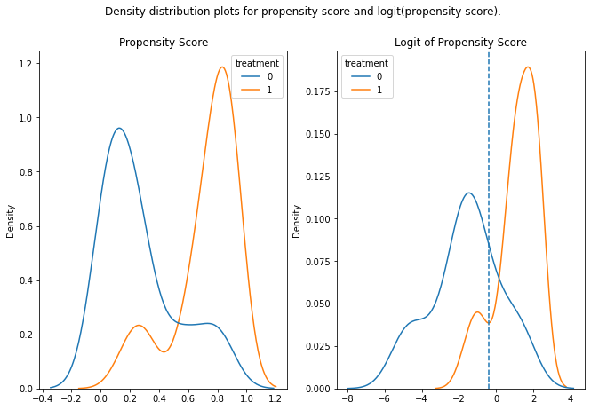
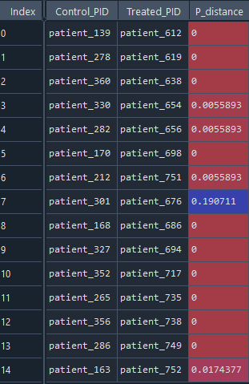
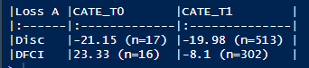
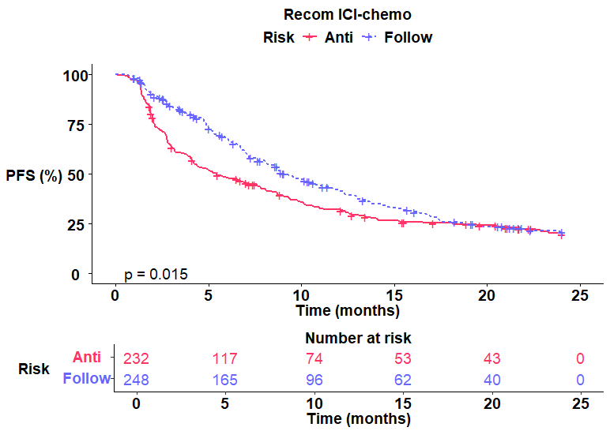
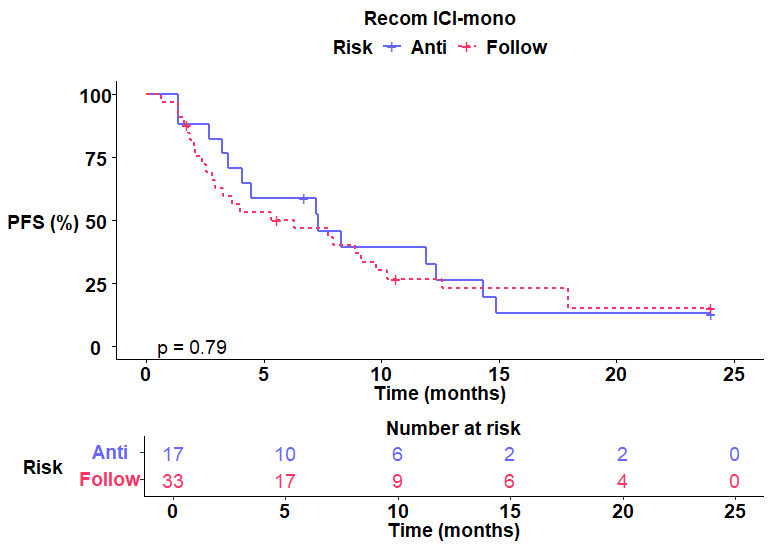
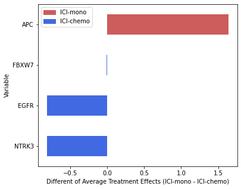

# A-STEP Framework: Quantifying Heterogeneous Treatment Effects

Attention-based Scoring for Treatment Effect Prediction (A-STEP) is an integrated framework that estimates the likelihood of benefit from adding chemotherapy to Immune Checkpoint Inhibitors (ICIs) therapy using five distinct weighting-based scoring functions. Using an attention-based mechanism from meta-heuristic family to fuse the five functions, A-STEP models the heterogenous treatment effects between ICI-Mono and ICI-Chemo for patients at risk for early progression using multimodal data from genomics and clinicopathological variables. Based on the benefit scores, A-STEP will then recommend which treatment is potentially more effective for a patient.

This repository contains the code for the A-STEP framework, which quantifies heterogeneous treatment effects as published in Nature Communications. The repository is organized into three primary folders: `Modeling`, `PSM`, and `SHAP`. Each folder contains scripts designed to facilitate model training, reproduction of results, and various analyses presented in the publication.


## Installation

To install A-STEP, you can use the following command to get the development version directly from GitHub:

```r
remotes::install_github("WuLabMDA/A-STEP")
```

Alternatively, you can clone the repository to your local machine. The repository contains the following files:
- **Modeling**: Facilitates model training and reproduction of analyses.
  - **`1. Train_from_scratch.R`**  
    Script for users who wish to train the model from scratch. This will involve training the model using the original datasets and parameters.
    
  - **`2. Reload_trained_models.R`**  
    Script for replicating the results published in the associated paper. This script utilizes pre-trained hyperparameters stored in the file `trained_models.RData`. You can download the pre-trained model from Zenodo at [https://zenodo.org/records/13736278](https://zenodo.org/records/13736278).
    
  - **`3. Interaction_plots.R`**  
    Script used to generate interaction plots as shown in the published paper.
    
  - **`4. Plot_PFS.R`**  
    Script used to generate Kaplan-Meier (KM) survival curves, as presented in the paper.
    
  - **`PrepareData_SHAP.R`**  
    Script used to preprocess the data for SHAP (SHapley Additive exPlanations) analysis.
    
- **PSM**: This folder provides an example of how users can conduct Propensity Score Matching (PSM) to create 1:1 matched pairs, as performed in the published study.
  - **`fn_CCM.py`**  
    A python program that contains the main functions to perform case control matching including the distance calculation between a candidate pair.
    
  - **`sample_data.csv`**  
    An example data to run case control matching.
    
  - **`Tutorial.py`**  
    The complete program for tutorial 1.

- **SHAP**: This folder contains the scripts used for conducting SHAP analysis, which was performed to interpret the model results in the paper.
  - **`fn_shap.py`**  
    A python program that contains the main functions to perform Shapley values calculation including generating the bar plots.
    
  - **`SHAP_prep.csv`**  
    An example of the input needed to calculate and generate the bar plots. This file can be prepared as instructed in tutorial 3.
    
  - **`Tutorials.py`**  
    The complete program for tutorial 3.

## Data Access
The data utilized in this study can be provided upon reasonable request. Please visit the following Zenodo link to request access: [Zenodo: https://zenodo.org/records/13368111](https://zenodo.org/records/13368111).

## Reference
To reference the A-STEP framework, please cite:

```bibtex
@article{AStep,
  title={A-STEP: An Attention-based Scoring for Treatment Effect Prediction in Immunotherapy-Treated Advanced-Stage NSCLC Patients},
  author={},
  journal={},
  year={Year},
  volume={Volume},
  pages={Pages},
  doi={DOI}
}
```

## Tutorials

This section provides step-by-step guides for using A-STEP's features.

### Overview
- [Tutorial 1: Case-Control Matching (Python)](#tutorial-1-case-control-matching-python)
- [Tutorial 2: Model Training (R)](#tutorial-2-model-training-r)
- [Tutorial 3: Model Interpretation with SHAP (R + Python)](#tutorial-3-model-interpretation-with-shap-r-python)

### Tutorial 1: Case-Control Matching (Python)

#### Import Required Libraries

```python
import numpy as np
import pandas as pd
import pathlib
import os
import fn_CCM as ccm
from sklearn.linear_model import LogisticRegression as lr
from sklearn.pipeline import Pipeline
from sklearn.preprocessing import StandardScaler
from sklearn import metrics
from scipy.special import logit
import matplotlib.pyplot as plt
import seaborn as sns
```

#### Prepare Data

```python
root_dir = pathlib.Path.cwd()
df_data = pd.read_csv('sample_data.csv')

y = df_data['prog_3_mo']
T = df_data['treatment']
columns = ["Gender","Age","Tobacco.Use","Pathology","PD.L1.expression","Line.of.IO_conden"]
X = df_data[columns]
```

#### Build a Regression Model

```python
model = Pipeline([('scaler', StandardScaler()), ('logistic_classifier', lr())])
model.fit(X, T)
predictions = model.predict_proba(X)
predictions_binary = model.predict(X)

print('Accuracy: {:.4f}\n'.format(metrics.accuracy_score(T, predictions_binary)))
```

#### Convert Probabilities to Logits

```python
predictions_logit = np.array([logit(xi) for xi in predictions[:, 1]])
```

#### Plot Density Distributions

```python
fig, ax = plt.subplots(1, 2, figsize=(11, 7))
fig.suptitle('Density distribution plots for propensity score and logit(propensity score).')
sns.kdeplot(x=predictions[:, 1], hue=T, ax=ax[0])
ax[0].set_title('Propensity Score')
sns.kdeplot(x=predictions_logit, hue=T, ax=ax[1])
ax[1].axvline(-0.4, ls='--')
ax[1].set_title('Logit of Propensity Score')
plt.show()
```


#### Find Match Pairs

```python
sigma = 0.25
interested_pid = df_psm.patient_id
df_all_match = pd.DataFrame()

distances, indexes = ccm.KNNeighbours(sigma, df_psm)
df_psm['results'] = df_psm.reset_index().apply(
    ccm.perfom_matching_v2, axis=1, args=(indexes, df_psm, distances))

val = ~df_psm.results.isna()
val = val.replace({True: 1, False: 0})

if sum(val) > 0:
    df_psm[['matched_element', 'distance']] = df_psm['results'].apply(pd.Series)
    df_psm = df_psm.drop(['results'], axis=1)
    matched_cohort = ~df_psm.matched_element.isna()
    matched_cohort = df_psm[matched_cohort][df_psm.columns]
    temp_out = ccm.One2One(matched_cohort, indexes, distances)  # One-to-one matching
    df_match = ccm.index2pid(temp_out, df_psm)
else:
    print('No matches found..')
```


### Tutorial 2: Model Training (R)

#### One-Time K-Fold Cross Validation

```r
library(personalized)
source("fn_biomarkers\\fn_train_model.R")
source("fn_biomarkers\\fn_eval_model.R")

df_mda <- read.csv("Matched_MDA.csv")
drops <- c('Liver.met','Brain.met','Met.status','OS', 'OS_events','PFS','PFS_events')
df_mda <- df_mda[ , !(names(df_mda) %in% drops)]
matched_ids <- read.csv("match_ids.csv")
x.varnames <- colnames(df_mda)[-1]

estimator = "weighting"
style = 'all'
kfold <- 5
loss_type <- "poisson_loss_lasso"

matched_ids <- matched_ids[sample(nrow(matched_ids)), ]
rownames(matched_ids) <- NULL
lossA <- cross_validation(df_mda, matched_ids, x.varnames, style, kfold, loss_type)

# Check selected variables
Sel_vars <- lossA[[6]]

# Check average treatment effect
Fold1 <- lossA[[3]][1]
Fold2 <- lossA[[3]][2]
```

#### Repeated k-fold CV ####
```r
library(personalized)
source("fn_biomarkers\\fn_train_model.R")
source("fn_biomarkers\\fn_eval_model.R")

# Example using MDA data
df_mda <- read.csv("Matched_MDA.csv")
outcome <- c('OS','OS_events','PFS','PFS_events')
mda_outcome <-df_mda[outcome]
drops <- c('Liver.met','Brain.met','Met.status','OS',
           'OS_events','PFS','PFS_events')
df_mda <- df_mda[ , !(names(df_mda) %in% drops)]
matched_ids <- read.csv("match_ids.csv")
x.varnames <-colnames(df_mda)[-1]

# Set tuning settings
estimator = "weighting"
style = 'all'
kfold <-5 #
loss_type <- "poisson_loss_lasso"
iter <-2 #repeated sampling number

# Create place to store iterations results 
dict_A <- list()
Freq_A <-data.frame()
train_cate_A <-data.frame()
valid_cate_A <-data.frame()
train_sample_A <-data.frame()
valid_sample_A <-data.frame()

# Run repeated CV--
for (run in 1:iter)
{
  print(sprintf("==== Sampling %d ====",run))
  matched_ids <-matched_ids[sample(nrow(matched_ids)), ]
  lossA <-cross_validation(df_mda,matched_ids,x.varnames,style,kfold,loss_type)
  dict_A[[run]] <- lossA
  sel_vars <- lossA[[6]]
  train_cate_A <-rbind(train_cate_A,dict_A[[run]][[1]])
  valid_cate_A <-rbind(valid_cate_A,dict_A[[run]][[2]])
  train_sample_A <-rbind(train_sample_A,dict_A[[run]][[7]])
  valid_sample_A <-rbind(valid_sample_A,dict_A[[run]][[8]])
  
  for (k in 1:(length(sel_vars)))
  {
    temp <- data.frame(sel_vars[[k]])
    colnames(temp) <- c('features')
    Freq_A <- rbind(Freq_A,temp)
    
  }
}

# Find average training results from the iterations 
avg_iter_results(train_cate_A,valid_cate_A,train_sample_A,valid_sample_A)

# Most important features 
freq_num <-3 # at least 3 times
Freq_A <- table(Freq_A)
Freq_A <- data.frame(Freq_A)
subset <- Freq_A[Freq_A$Freq>=freq_num,]
rownames(subset) <-NULL
sel_varnames <- as.character(subset$features)
valid_set <-c()
valid_cate <-c()

# Now use the selected features above to refit on MDA data again 
refit_A <- refit_features(df_mda,valid_set,sel_varnames,style,loss_type)
trained_model <-refit_A[[2]]
train_cate <- refit_A[[1]]# training ATE

# Test on external dataset
df_dana <-read.csv("Matched_DANA.csv")
test_results <-refit_external(trained_model,df_dana)
test_cate <-test_results[[1]]
table <- avg_cate(train_cate,valid_cate,test_cate,'Loss A')
knitr::kable(table, format = "markdown")
```



#### Plot survival ####
```r
source("fn_biomarkers\\fn_recom_plots.R")
# censoring
t <-24
for (i in 1:dim(mda_outcome)[1])
{
  time <-mda_outcome[i,]['PFS']
  event <-mda_outcome[i,]['PFS_events']
  if (time > t)
  {
    mda_outcome[i,]['PFS'] <- t
    mda_outcome[i,]['PFS_events'] <-0
    
  }
}

# Custom theme for plotting
custom_theme <- function() {
  theme_survminer() %+replace%
    theme(
      plot.title=element_text(size = 14, color = "black",hjust=0.5,face = "bold"),
      axis.text.x = element_text(size = 14, color = "black", face = "bold"),
      legend.text = element_text(size = 14, color = "black", face = "bold"),
      legend.title = element_text(size = 14, color = "black", face = "bold"),
      axis.text.y = element_text(size = 14, color = "black", face = "bold"),
      axis.title.x = element_text(size = 14, color = "black", face = "bold"),
      axis.title.y = element_text(size = 14, color = "black", face = "bold") , #angle=(90))
    )
}

recom <- trained_model$recommended.trts
actual <- df_mda$treatment
pid <- df_mda$patient_id
recomA <- cbind(pid,recom,actual)
recomA <- data.frame(recomA,mda_outcome)
fit <-recom_plot(recomA,custom_theme)
# ‘Anti’ means recommended plans are contradicted to actual treatment received
# ‘Follow’ means recommended plans are similar to actual treatment received
# In this particular example (single loss) – only ICI-chemo arm works.

```



### Tutorial 3: Model Interpretation with SHAP (R + Python)

#### Run in R

```r
b.scores <- trained_model$benefit.scores
features <- df_mda[sel_varnames]
shap_data <- cbind(features, b.scores)
write.csv(shap_data, 'SHAP_prep.csv')
```

#### Run in Python

```python
import pandas as pd
import shap
from sklearn import linear_model

root_dir = pathlib.Path.cwd()
df = pd.read_csv('SHAP_prep.csv')
X = df.iloc[:, :-1]
Y = df['b.scores']

model = linear_model.LinearRegression()
model.fit(X, Y)

explainer = shap.Explainer(model.predict, X)
shap_values = explainer(X)

# Visualize SHAP values
shap.summary_plot(shap_values, X)
```


